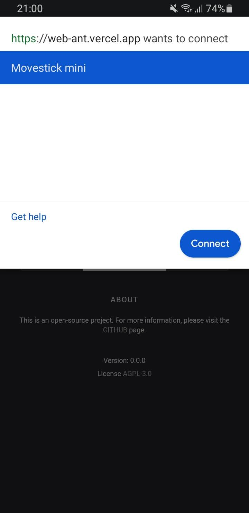

# WebANT+

A project to bring ANT+ connectivity to the browser.

## Support

Works with Google Chrome on MacOS, Linux (Ubuntu) and Android. Requires ANT+ stick on all operating systems. Support for Windows 10 might be possible in the future.

The current development setup uses Suunto movestick mini, Garmin Fenix 5 watch broadcasting heart rate, Tacx Heart Rate monitor, Tacx Flux S trainer.

## Demo

Just published the first working version of the [demo](https://web-ant.vercel.app/), it's very basic, most of the UI is not yet functional, but you can coonect ANT+ Heart Rate Monitor or ANT+ controllable trainer (it must have the FE-C profile), and see some data readings and try out ERG and Slope mode.

## How to use the demo

1. click on the grey ANT+ label at the top, in order to connect the USB stick
2. click OK to give permissions for the usb stick, now the grey ANT+ label should become white
3. start search for a device by clicking on one of the chip icons with the red dot
4. once a device is found it will show inside the seach popup, select a device by clicking on it's name and click pair. Note that 17 means Controllable, 120 Heart Rate Monitor.
5. once done click the chip icon with the green dot to properly disconnect the device, else it will leave an open channel,
   and you will need to reload the page and reattach the usb stick.

<table>
  <tr>
     <td>
       
     </td>
     <td>
       
     </td>
     <td>
       
     </td>
  </tr>
  <tr>
     <td>
       
     </td>
     <td>
       
     </td>
     <td>
       
     </td>
  </tr>
</table>

It doesn't yet handle page reloads, and the order of steps is very important, else the ANT+ stick might end up a in wrong state. You will need reload the page and start over. 

If it doesn't work the developer console will have some information about the reason.
You can open an issue here and attach a screenshot or something with the error in the console + some info on your setup (OS, Device, Trainer, ANT+ usb stick manufacturer).
